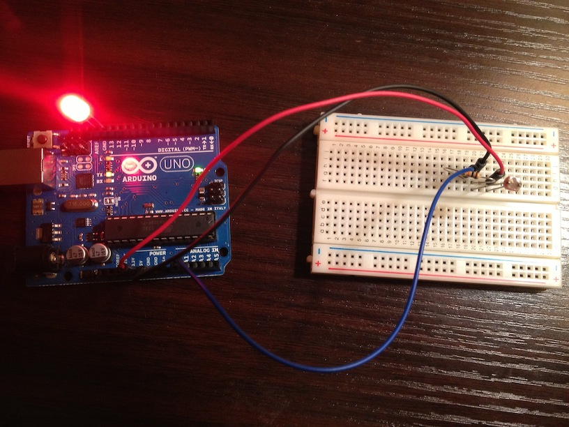

#### Robo

Robo is an emotional Robot built with Arduino, Processing, and Chuck.

Robo has 6 emotional states:

- Happy
- Sad
- Angry
- Bored
- Excited
- Shocked

However, most of the time Robo is asleep (Robo is less likely to wake up when it's dark).

Each emotional state will be represented by a blinking LED and a robot face in a window on your computer. If you get him excited enough, he may even try to help you code! (he tries).

#### Getting Started

To get him running:
- Open `robo_arduino.ini` Arduino 
- Open `robo_processing.pde` in Processing.
- Plug your Arduino into your computer
- Upload the Arduino sketch to your Arduino
- Run the Processing sketch.
- Run the chuck script

Your Arduino should look something like this:
- Pin 13 connected to LED
- 5V connected to one leg of light sensor
- Resistor connected to other leg of light sensor
- The resistor leg that's connected to the light sensor also be should be connected to ground
- A0 connected to other resistor leg 

#### Bad Schematic

